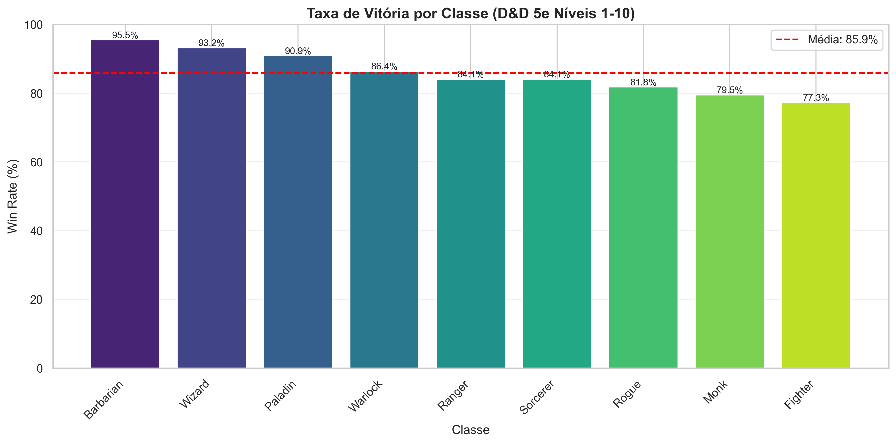
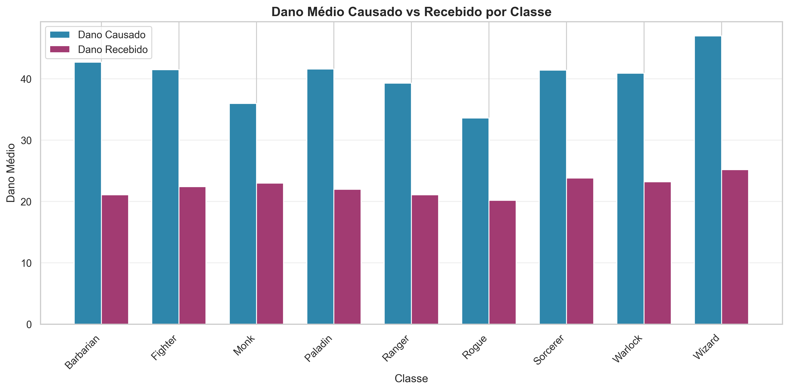
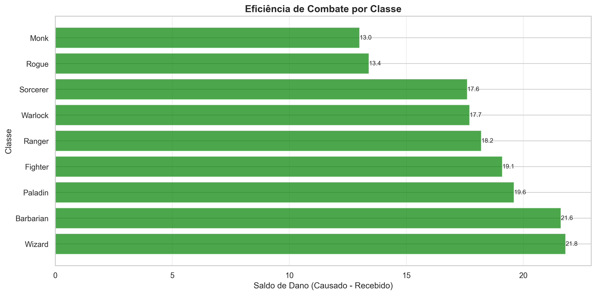
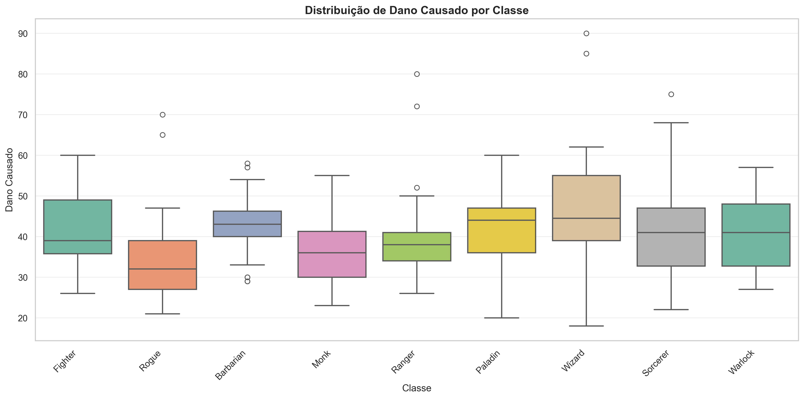
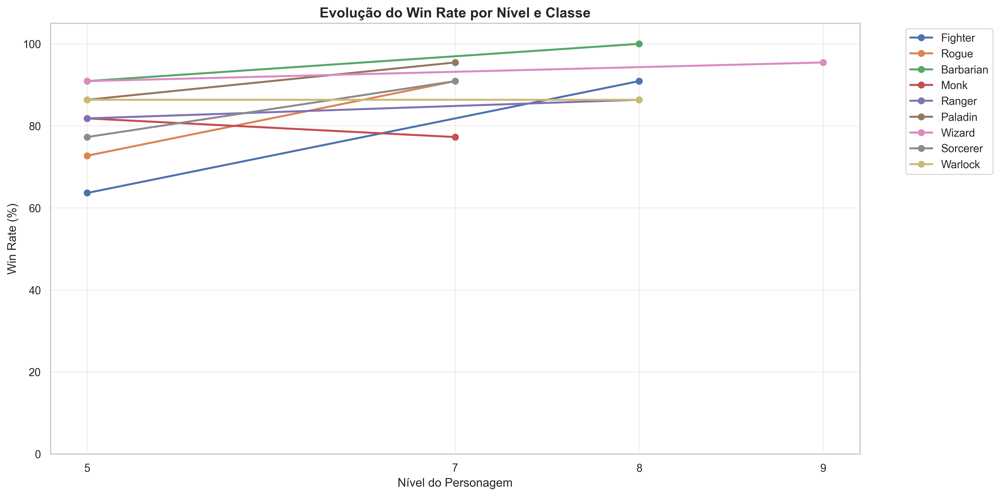
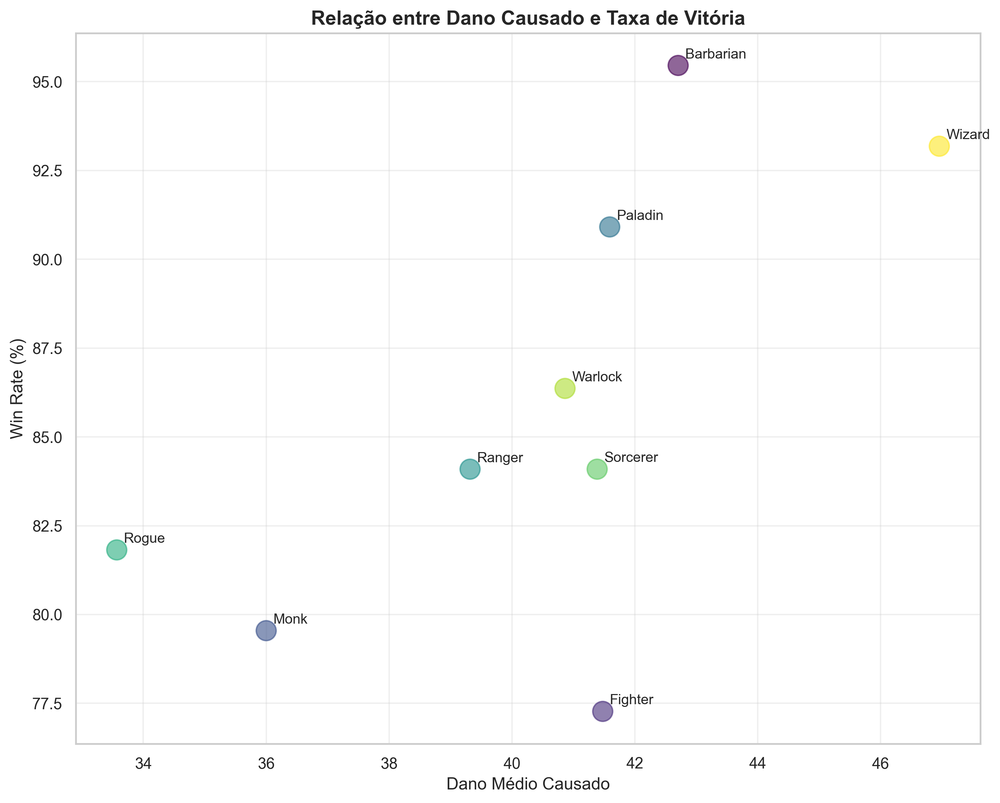
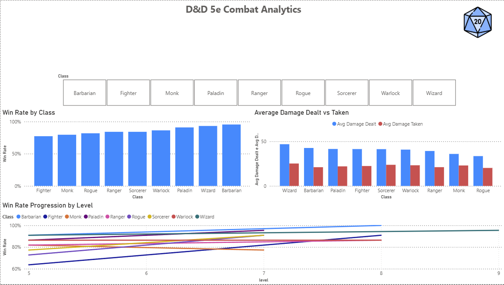

# D&D RPG Analytics

Projeto de análise de dados com um sistema simplificado que é inspirado no D&D 5e 2024.

## Sobre
Os dados são simulados com base nas mecânicas do D&D 5e, adaptadas
para um modelo relacional analítico. O objetivo não é replicar o sistema
fielmente, mas usar sua estrutura para praticar SQL, Python e visualização de dados.

## Problema que quero resolver
"Algumas classes parecem fortes, mas não se sabe se são eficientes na faixa de níveis comumente mais jogados."

Segundo dados do **D&D Beyond** e pesquisas da comunidade, a grande maioria das campanhas termina ou estagna entre os **níveis 7 e 10**.
Por isso, esta análise foca exclusivamente na faixa **níveis 1–10**, tornando os resultados relevantes para a realidade da maioria dos jogadores.

## Perguntas que este projeto responde
- Qual classe é mais eficiente nos níveis 1–10?
- Qual classe causa mais dano em média?
- Qual classe tem a maior taxa de vitória?
- Quais classes são superestimadas porque só brilham após o nível 10?

## Resultados

### Win Rate por Classe

### Dano Causado vs Recebido

### Eficiência — Saldo de Dano

### Distribuição de Dano por Classe

### Evolução do Win Rate por Nível

### Correlação: Dano vs Win Rate

### Dashboard Power BI

## Conclusões

- **Barbarian** apresenta o maior saldo de dano e alta resistência graças ao HP elevado, confirmando sua força nos níveis iniciais.
- **Wizard e Sorcerer** causam dano acima da média, mas recebem proporcionalmente mais — alto dano não garante vitória sozinho.
- **Paladin** demonstra o melhor equilíbrio entre dano causado e resistência, sendo a classe mais eficiente e consistente na faixa 1–10.
- A correlação entre dano causado e win rate é moderada, indicando que **sobrevivência importa tanto quanto ataque** — classes com mais HP tendem a vencer mais mesmo causando menos dano.
- Classes que dependem de recursos de alto nível (Wizard, Sorcerer) são menos confiáveis nos níveis iniciais, respondendo à pergunta sobre classes superestimadas.

## Stack
| Ferramenta | Uso |
|---|---|
| SQLite + SQL | Modelagem relacional e queries |
| Python (pandas, numpy) | Simulação de combates e análise |
| Power BI | Dashboard interativo de eficiência |

## Classes Analisadas
Fighter · Rogue · Barbarian · Monk · Ranger · Paladin · Wizard · Sorcerer · Warlock

## Estrutura do Banco
- `classes` — características base de cada classe (força, inteligência, defesa, vida)
- `personagens` — personagens nos níveis 1–10 vinculados a uma classe
- `combates` — resultado de cada encontro (dano causado, recebido e vitória)

## Roadmap
- [x] Semana 1 — Modelagem e banco de dados
- [x] Semana 2 — Simulação de combates com Python
- [x] Semana 3 — Análise exploratória (dano médio, win rate, eficiência)
- [x] Semana 4 — Dashboard Power BI

## Fonte
*"Dados do D&D Beyond e surveys de comunidades no fórum oficial e Reddit apontam que grande parte das campanhas de D&D 5e terminam entre os níveis 7-10."*